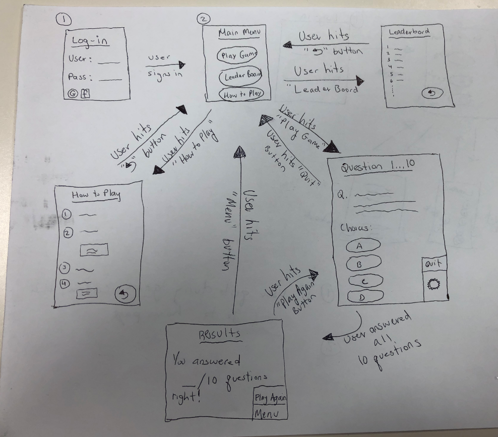

# hci-teamID-3
Project 2 (Game Development) for Human Computer Interaction

## Links 

* Github Repository:  https://github.com/hci-team-id-3/P2.3
* Presentation Link:  https://hci-team-id-3.github.io/P2.3/

## Sketch




## General Description of the Game

  Our group will be implementing a trivia game similar to the mobile game Trivia Crack. The main menu would contain buttons for users to play the game, learn the rules, and see scoreboard.  In other words it will be a very simple main menu interface consisting of the following 3 action buttons: "Play Game", "How to Play", and "Leaderboard".   Once the user clicks on the respective button, the game will take the user to the appropriate screen.  For example, if the user clicks the "How to Play" action button, then the game interface will display a screen with the step by step rules to play the game.  

  Once the user is ready to play, they will click the "Play Game" button.  This action item will begin the game and the user must click on answer choices in response to the trivia question on the screen.  The game will go question by question, meaning that after answering the question, the game will give the user feedback of their answer choice.  If user answered correctly, then the answer button/choice will highlight green and the user will also receive a "check" sound effect.  However, if the user answers incorrectly, the answer button/choice will highlight red and the user will also receive a buzzer sound effect.  Despite whether they answered correctly or not, after receiving feed back on the question, the game will move on to the next question till the round ends.  
 
## How far did you go with implementation? 

At the moment, we have a rough sketch (located above) of what the game interface would look like as well as the main functionality of the game.  The game would be designed primarily in HTML, CSS, and JavaScript libraries.  

## Plan to move forward
Plan to move forward would be first developing a game prototype.  Then determine what technology/languages we would need to use to create the user interface.  After having a very basic game prototype done, we would continue to enhance the game design to look more appealing to the user.  

* Jason Mba:  Questions & Results Screen 
* Michael Kiros:  Log-in scren 
* Ukoh Ndukwo:  Leaderboard screen
* John Yucetas:  Main Menu screen
* Pratik Patel:  How to play screen

## Task Description
Users will answer questions from the website, with a popup notifiying them if they got a question right or wrong.

## Playing the game on your own local machine
In order to play the game, you must have Django installed. Here are the steps:

```
Windows
pip install django
```

```
Linux
pip3 install django
```
Once Django is installed, run the following commands for your respective machine

```
Windows
python manage.py runserver
```

```
Linux
python3 manage.py runserver
```

To add another user, run the server and visit `127.0.0.1:8000/admin` and use the following username/password:

```
Username: admin
Password: Password123!
```


## Hypothesis
Users will be able to gauge how to play the game using the how to play page on the website. Users will then be able to play the game by answering questions. 

## Team Members 

* Jason Mba
* Michael Kiros 
* Ukoh Ndukwo
* John Yucetas
* Pratik Patel

## Group Picture 


